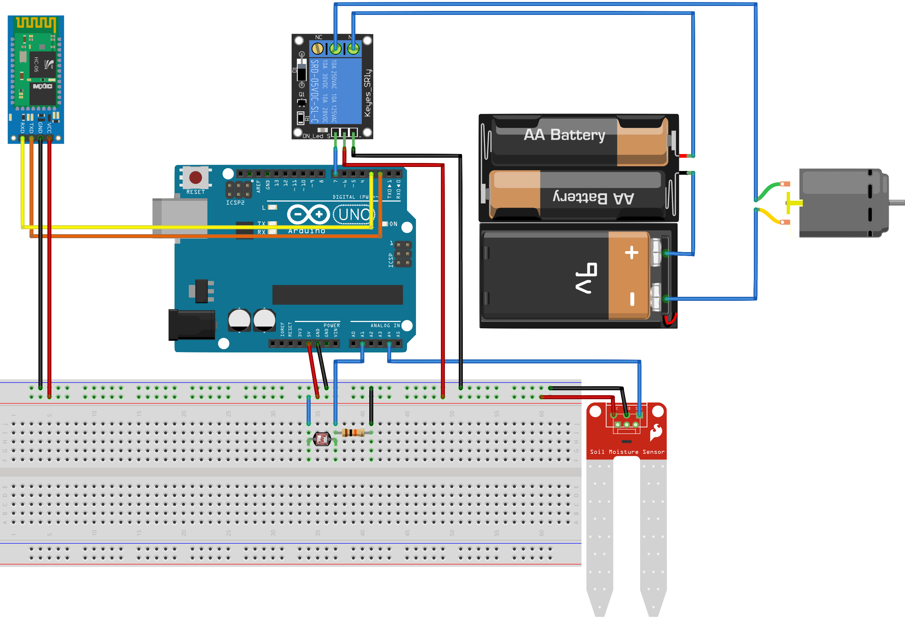

## Download
### Code
Clone this repo or just download the file, upload the file to your Arduino(you might want to adjust some parameters), download the iOS app, you are good to go!
### App
GitHub Link: https://github.com/rexhanh/WateringSystem_iOS

iOS Testflight Link: TBA

## Setup
I used Arduino Uno, DSD Tech HM-10, a 12V water pump, a capacitive soil moisture, a 2 channel 5v relay and a photodiode. I did not have a 12V source, so I used two 1.5V batteries and one 9V battery to power the pump.

### Pins

|Arduino|Pin 2| Pin 3| Pin 7| Pin A1| Pin A4|5V|GND|
|-----|-----|-----|------|-----|-----|-----|-----|
|DSD HM-10|**TX**|**RX**|N/A|N/A|N/A|**VCC**|**GND**|
|Relay|N/A|N/A|**IN1**|N/A|N/A|N/A|**GND**|
|Light Sensor|N/A|N/A|N/A|**-**|N/A|**+**|**Resistor**|
|Moisture Sensor|N/A|N/A|N/A|N/A|**AOUT**|**VCC**|**GND**|

### Layout

## Improvement
1. Support more moisture sensors and pumps
2. Does not support self-watering yet, only can be turned on/off on the app, maybe add a physical button in the future.
3. Instead of Bluetooth connection, using Arduino to host a server to support outside control?
4. Final goal: Put it into a PCB and make a 3D self-watering printed pot.
